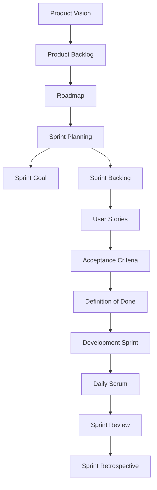

# Scrum Workflow

## Amaç

Bu doküman, ürün fikrinin oluşturulmasından Sprint'in tamamlanmasına kadar izlenen Scrum sürecini görsel olarak açıklamak amacıyla hazırlanmıştır.

---

# Scrum Workflow Diagram

---

# Süreç Açıklaması

| Adım                 | Açıklama                                                                                |
| -------------------- | --------------------------------------------------------------------------------------- |
| Product Vision       | Ürünün amacı, hedef kitlesi ve sağlayacağı iş değeri tanımlanır.                        |
| Product Backlog      | Üründe geliştirilmesi planlanan tüm iş kalemleri önceliklendirilir.                     |
| Roadmap              | Ürün geliştirme çalışmaları sprint bazında planlanır.                                   |
| Sprint Planning      | Sprint kapsamında geliştirilecek Product Backlog öğeleri seçilir.                       |
| Sprint Goal          | Sprint sonunda ulaşılması hedeflenen iş çıktısı belirlenir.                             |
| Sprint Backlog       | Sprint boyunca geliştirilecek iş kalemleri listelenir.                                  |
| User Stories         | Kullanıcı ihtiyaçları kullanıcı bakış açısıyla tanımlanır.                              |
| Acceptance Criteria  | Her User Story için kabul koşulları belirlenir.                                         |
| Definition of Done   | Bir iş kaleminin tamamlanmış sayılması için gereken ortak kalite kriterleri tanımlanır. |
| Development Sprint   | Sprint boyunca geliştirme faaliyetleri yürütülür.                                       |
| Daily Scrum          | Ekip günlük olarak ilerlemeyi değerlendirir ve planını günceller.                       |
| Sprint Review        | Sprint sonunda tamamlanan ürün çıktıları gözden geçirilir.                              |
| Sprint Retrospective | Ekip çalışma sürecini değerlendirir ve iyileştirme alanlarını belirler.                 |

---

# Notlar

* Bu diyagram, Scrum çerçevesinde örnek bir ürün geliştirme sürecini göstermektedir.
* Süreç, Product Vision ile başlar ve Sprint Retrospective ile tamamlanır.
* Sprint tamamlandıktan sonra elde edilen geri bildirimler doğrultusunda Product Backlog güncellenebilir ve yeni bir sprint planlaması yapılabilir.
